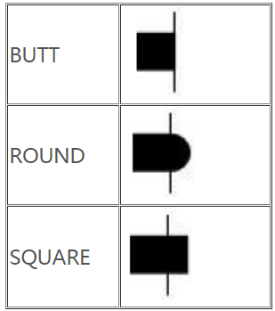
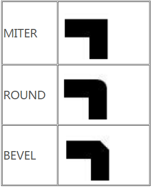

#自定义控件demo

##1.设置Stroke的样式:
BUTT是setStrokeCap的默认设置，下面看几张图片可以看出BUTT、ROUND、SQUARE的区别。

该方法用来设置我们画笔的 笔触风格 ，比如：ROUND，表示是圆角的笔触。那么什么叫笔触呢，其实很简单，就像我们现实世界中的笔，如果你用圆珠笔在纸上戳一点，那么这个点一定是个圆，即便很小，它代表了笔的笔触形状，如果我们把一支铅笔笔尖削成方形的，那么画出来的线条会是一条弯曲的“矩形”，这就是笔触的意思。

竖线处即为画笔结束处

------

setStrokeJoin默认是MITER，他是用来控制画的图形接触时候的样式的。
ROUND:让画的线圆滑设置结合处的样子，Miter:结合处为锐角， Round:结合处为圆弧：BEVEL：结合处为直线。这个方法用于设置接合处的形态，就像你用代码画了一条线，但是这条线其实是由无数条小线拼接成的，拼接处的形状就由该方法指定。

##2.onSizeChanged调用的时机是在onMeasure之后, 虽然可以再onMeasure中获取控件的高度,但是onMeasure会调用多次, onSizeChanged只会调用一次, 所以最好在onSizeChanged方法获取控件的大小, onSizeChanged不会获取控件的getTop, getLeft, 因为onSizechanged方法在onLayout之前执行, 这个时候还没有确定控件和子控件的位置, 所以getTop=0